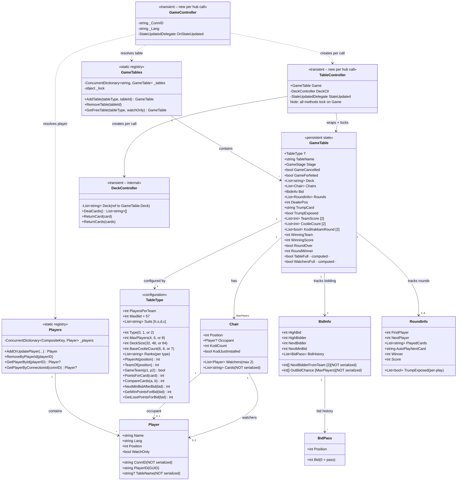
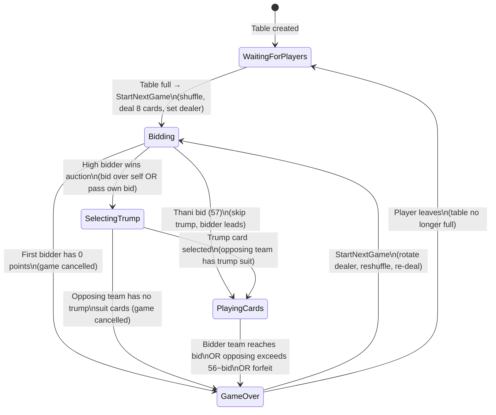
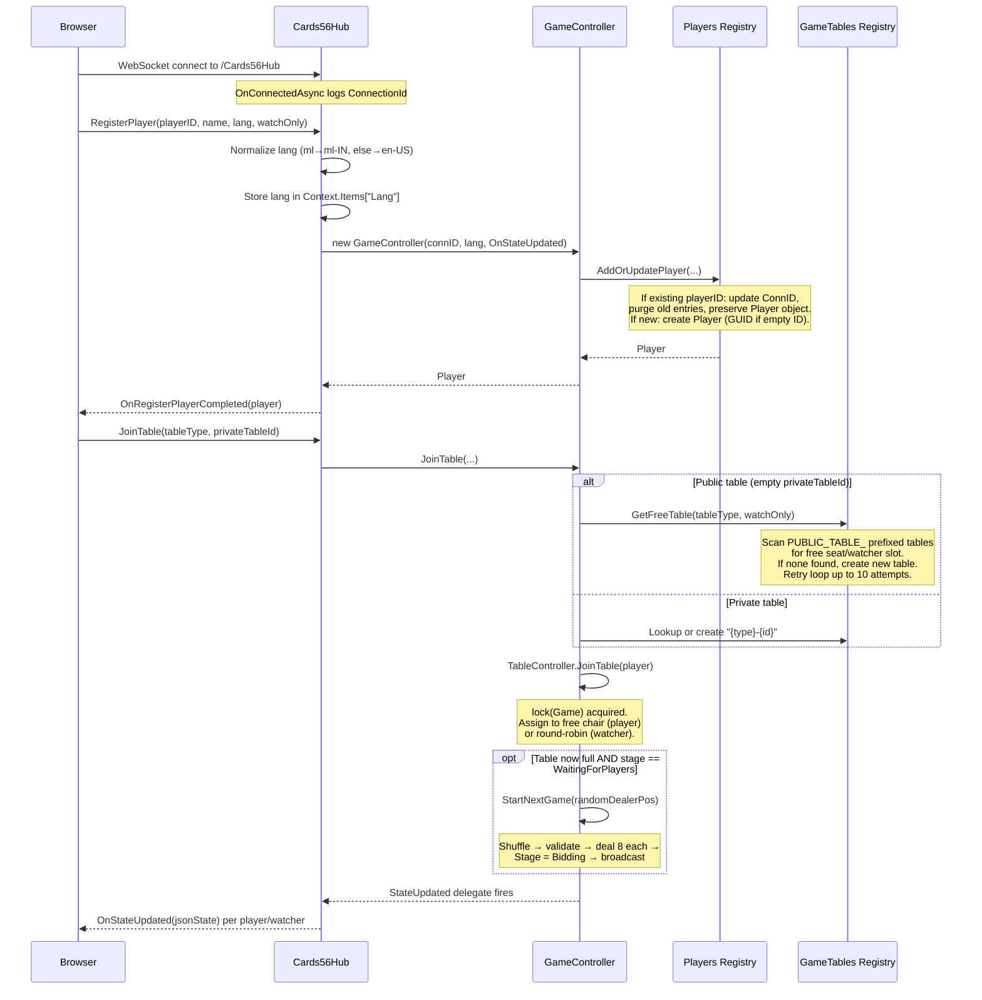
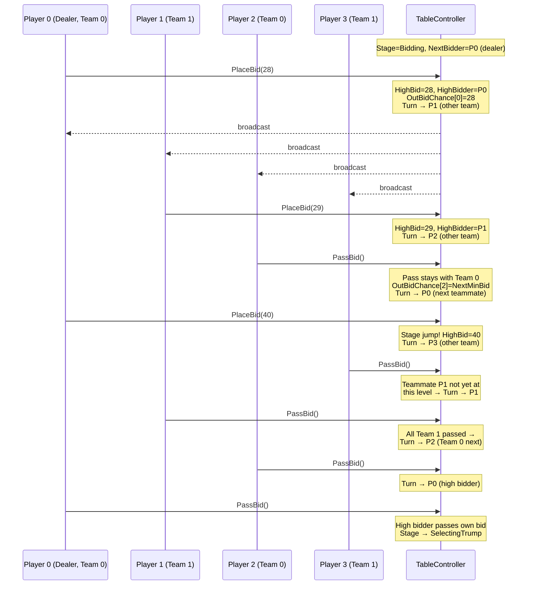
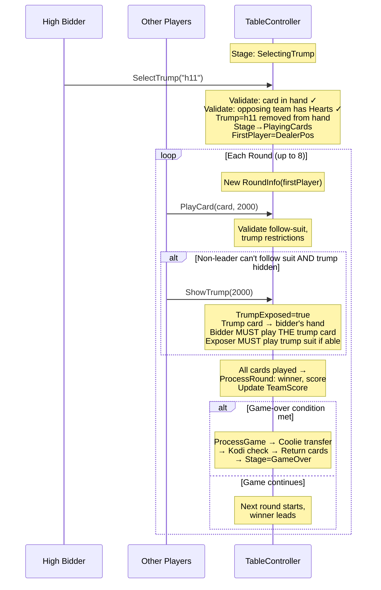
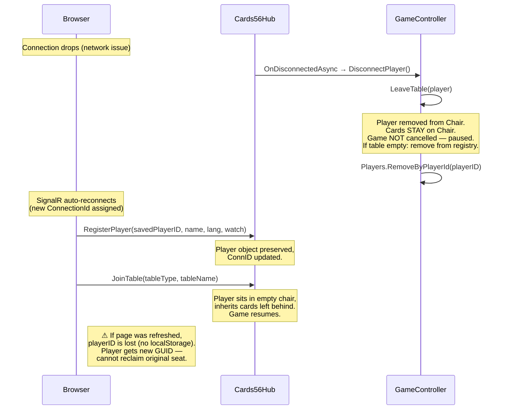

# 56 Cards — Domain Knowledge Document

> **Audience:** Technical team members unfamiliar with this domain.
> **Sources:** Source code analysis (Cards56Lib, Cards56Web, client JS/CSS/HTML) and domain expert clarifications.
> **Convention:** Where sources conflict or are ambiguous, this document flags the issue explicitly with ⚠️ rather than silently choosing one interpretation.

---

## 1. Executive Summary

**56 Cards** (also known as *Ambathiyaru*) is a real-time multiplayer trick-taking card game from South India (Kerala / Tamil Nadu). Per the domain expert:

> *In the highly competitive and vocal world of Kerala's 56 (Ambathiyaru) card game, the table banter is just as important as your strategy!*

The name comes from the total point value of all scoring cards in the deck: exactly **56**. Two teams compete across a series of games: one team bids a point target it promises to reach, selects a hidden trump suit, then both teams play tricks (rounds) to accumulate card points.

A meta-scoring layer of **Coolies** (team point reserves) and **Kodis** (penalty markers on individual players) tracks long-term match standing. Both *kunukku* and *kodi* are classic slang terms used to describe massive wins or embarrassing losses — metaphorical badges of dishonor. The only way to "take the kunukku off" is to aggressively bid and win enough hands.

**There is no match-level win condition.** Per the domain expert: *"The game is played for fun. Games continue indefinitely with Kodi accumulating and being removed. The game ends when the players get tired and go to sleep."*

The system is implemented as:
- **Server:** ASP.NET Core 8.0 with SignalR (WebSocket) for real-time communication. All game logic and state live server-side in `Cards56Lib`. No database; all state is in-memory. The architecture is **fully server-authoritative**: the client renders whatever `OnStateUpdated` delivers, validates nothing locally, and submits all actions to the server for validation.
- **Client:** jQuery-based single-page app (`table.html`) using a modified `cards.js` rendering library (PINOCHLE card type). Communicates exclusively via SignalR hub methods.
- **Deployment:** Docker container, HTTP on port 80, no authentication, no persistence across server restarts.

The system supports three table sizes (4, 6, or 8 players), public matchmaking, private named tables (shared via WhatsApp or similar), a spectator/watcher mode, and bilingual UI (Malayalam and English).

---

## 2. Glossary

| Term | Also Known As | Definition |
|------|---------------|------------|
| **56** | Ambathiyaru | The card game itself. Named for the 56 total card points in the deck. |
| **Trick** | Round | One play cycle where each active player contributes one card. The highest card wins the trick. |
| **Trump** | Thuruppucard | A designated suit that beats all other suits. Selected by the high bidder after the auction. Hidden from all other players until exposed mid-game. |
| **Trump Exposure** | Show Trump | Revealing the hidden trump suit to all players. Triggered when a non-leading player cannot follow the round suit. |
| **Thani** | — | The maximum bid (tracked as 57 internally). The bidder plays alone against all opponents, without trump. Must win all 8 rounds. Per the domain expert: *"From a bidding perspective this is the highest bid, but it does not translate to a number."* |
| **Bid** | — | A numeric promise (28–57) of how many card points the bidding team will capture. |
| **Pass** | — | Declining to bid. Recorded as bid value `0` in `BidPass`. Only allowed after at least one bid exists. |
| **Bid Stage** | Bid Level | A bracket within the bid range that determines scoring multipliers: Base (28–39), Honors (40–47), 48-Level (48–55), Full (56), Thani (57). |
| **Coolie** | Koolie | Team-level point reserve. Starts at a base count per team. Transferred between teams after each game. When depleted to zero, triggers Kodi installation. |
| **Kodi** | Kunukku, Kunuk | Penalty marker placed on individual player chairs when their team's coolies are exhausted. A badge of dishonor in Kerala card culture. Removed by winning as the high bidder. |
| **KodiIrakkamRound** | — | The first game immediately after a team receives Kodi. If that team wins as the bidding team, *all* teammates remove one Kodi each (not just the bidder). Not lost on game cancellation — carries to the next game. |
| **Chair** | Seat, Position | A numbered slot (0 to MaxPlayers−1) at a table. Holds one occupant and up to 2 watchers. Stores dealt cards and Kodi state. |
| **Watcher** | Observer, Spectator | Non-playing participant who sees the occupant's cards and game state. Cannot bid, play, or forfeit. Mimics the real-world practice of standing behind a player to watch. |
| **Dealer** | First Bidder | The player who deals cards and gets the first bidding opportunity. Rotates anti-clockwise after each completed game. |
| **Table** | GameTable | A game session with chairs, a deck, and all associated game state. |
| **Public Table** | — | Auto-created table for matchmaking. Named `PUBLIC_TABLE_{GUID}`. |
| **Private Table** | Named Table | A table with a user-chosen name, shared out-of-band (e.g., WhatsApp). Named `{tableType}-{name}`. |
| **Round Suit** | Led Suit | The suit of the first card played in a trick. Subsequent players must follow suit if able. |
| **Auto-play** | — | Mechanism that plays forced moves automatically. Three distinct variants exist (see §5.7). |
| **Forfeit** | — | Voluntarily conceding the game. Awards maximum points to the opposing team. |
| **PINOCHLE** | — | Card type configuration used by the `cards.js` rendering library. Its double-deck composition matches 56's requirements. |
| **StateUpdatedDelegate** | — | Server callback pattern that pushes personalized game state JSON to each client after every mutation. |

---

## 3. Core Domain Entities and Relationships

### 3.1 Domain Model



### 3.2 Key Structural Rules

**Teams are positional:** `TeamOf(position) = position % 2`. Even seats (0, 2, 4, …) form Team 0; odd seats (1, 3, 5, …) form Team 1. Teammates sit 2 positions apart.

**Transient controllers, persistent state:** `GameController`, `TableController`, and `DeckController` are recreated on every SignalR hub method call. All persistent state lives in `GameTable` and `Player` objects within the static `GameTables` and `Players` registries.

**Thread safety via `lock(Game)`:** Every mutating `TableController` method acquires `lock(Game)` on the shared `GameTable` object reference. Since all transient controllers for the same table reference the *same* `GameTable` instance from the static registry, they all contend on the same monitor. Only one hub call per table executes at a time; different tables operate concurrently without contention. (See §6.5 for deep-dive.)

### 3.3 Personalized State Serialization

Each client receives a **personalized** JSON state via `GetJsonState(player)`. Fields with `[JsonProperty]` are serialized; others are withheld:

| Data | Client Visibility | Mechanism |
|------|-------------------|-----------|
| Player's own cards | ✅ | Via top-level `PlayerCards` (from `Chairs[position].Cards`) |
| Other players' cards | ❌ | `Chair.Cards` lacks `[JsonProperty]` — excluded from JSON |
| Trump card | ✅ Conditional | Only if recipient is the high bidder OR trump is exposed |
| Deck contents | ❌ | `Deck` lacks `[JsonProperty]` — never sent |
| `OutBidChance`, `NextBidderFromTeam` | ❌ | `BidInfo` internal fields lack `[JsonProperty]` |
| `KodiIrakkamRound` | ❌ | Internal only |
| `GameStage` | ✅ | Sent as top-level field (not from `GameTable` — `Stage` has no `[JsonProperty]` there) |
| Chairs, Bid, Rounds, Scores, Coolies, Kodi counts | ✅ | Full serialization via `TableInfo = Game` |

Watchers on a chair receive the **same personalized state as the occupant** — same cards, same trump visibility — because watchers inherit the chair's `Position`.

### 3.4 Client-Side Entities

| Entity | File | Role |
|--------|------|------|
| **Game** | `game.js` | Central client orchestrator. Manages SignalR lifecycle, hub invocations, `OnStateUpdated` rendering. Holds deserialized `gameState` and derives local perspective via position offsetting: `(serverPos - myPos + maxPlayers) % maxPlayers`. |
| **Table** | `table.js` | UI manager for card surface. Wraps `cards.js` library (PINOCHLE). Manages player hand, round card decks, trump card, last-round display, coolies, scores, center messages, alerts, buttons. |
| **Player** | `player.js` | Per-seat UI component. Renders team-colored icon, name, dealer badge, bid display (high/current/previous), focus animation (blinking border), kodi markers (up to 14), watcher names. Position-aware CSS for 4/6/8-player layouts. |
| **BidPanel** | `bid_panel.js` | Popup for placing bids. Buttons 28–56 in 3 rows + Thani (57) + Pass (0). Disables buttons below `NextMinBid`. |

---

## 4. Business Rules

### 4.1 Table Variants

| Property | Type 0 | Type 1 | Type 2 |
|----------|--------|--------|--------|
| Players | 4 | 6 | 8 |
| Players per team | 2 | 3 | 4 |
| Deck size | 32 | 48 | 64 |
| Cards per player | 8 | 8 | 8 |
| Ranks (low → high) | 10, A, 9, J | Q, K, 10, A, 9, J | 7, 8, Q, K, 10, A, 9, J |
| Base coolie count | 6 | 6 | 7 |

All variants use 4 suits (Hearts, Spades, Diamonds, Clubs) and a **double deck** (each card appears twice): `DeckSize = 4 suits × rank_count × 2`.

Per the domain expert: *"Suits really don't have an order. In implementation suits are sorted as Hearts < Spades < Diamonds < Clubs for simplicity."*

### 4.2 Card Point Values

| Card | Rank Code | Points |
|------|-----------|--------|
| Jack | 11 | 3 |
| Nine | 9 | 2 |
| Ace | 1 | 1 |
| Ten | 10 | 1 |
| King, Queen, 8, 7 | 13, 12, 8, 7 | 0 |

Total across all cards in any variant: **56** (hence the game name).

### 4.3 Deck and Dealing

- **Shuffle algorithm:** Cut-and-move (top-to-bottom, middle-to-bottom) repeated 30 times on a fresh deck, 6 times on re-shuffles. Per the domain expert: *"This method produced sufficient shuffle quality — many other attempts failed or were not as good."*
- **Shuffle validation:** No player's hand may be all one suit. Per the domain expert: *"If a player gets all cards of the same suit then that shuffle should be considered invalid and a reshuffle should be done."* Implemented as a `while(true)` loop. ⚠️ *No escape hatch exists — a corrupt deck could cause an infinite loop.*
- **Deal:** 8 cards per player, sorted by `CompareCards` (suit then rank).
- **Card lifecycle:** Played cards return to the deck immediately after play via `ReturnCard`/`ReturnCards`, so the deck reconstitutes for the next game without rebuilding from scratch.

### 4.4 Bidding Rules

**Range:** Minimum 28, maximum 57 (Thani).

**Bid stages and scoring:**

| Stage | Range | Win Points (bidder wins) | Lose Points (bidder loses) |
|-------|-------|--------------------------|----------------------------|
| Stage-1 | 28–39 | 1 | 2 |
| Stage-2 | 40–47 | 2 | 3 |
| Stage-3 | 48–55 | 3 | 4 |
| Stage-4 | 56 | 4 | 5 |
| Stage-5 | 57 | BaseCoolieCount × 2 | BaseCoolieCount × 2 |

Lose penalty is always 1 more than win reward, except Thani where they are equal (and large enough to guarantee Kodi).

**Stage-jump minimums (`NextMinBidAfterBid`):** When re-entering bidding, the minimum jumps to the next stage boundary: `<28 → 28`, `28–39 → 40`, `40+ → 48`. A player cannot bid below their previous stage.

**Bidding alternation logic** (from domain expert):

> Bidding goes anti-clockwise. The dealer is the first bidder for his team; the player to his right is the first bidder for the opposing team. When a team member bids, the chance moves to the opposite team. When a team member passes, the chance remains with his team, moving to the next teammate to the right. When all team members from one team pass the opposing team's bid, the bidding goes back to the bidding team — the teammate to the right of the bidder gets a chance. When outbidding one's own teammate or oneself, the bid must be in the next level for that player. After the bidding returns to the current high bidder and he decides to pass his own bid (or raise to a higher level), the bidding rounds end.

**Key mechanism — `OutBidChance`:** Records the bid value at which each player last participated. Used to calculate `NextMinBid = max(HighBid+1, NextMinBidAfterBid(OutBidChance[player]))`. This prevents players from bidding below their previous participation level.

**Pass restrictions:** Pass is only allowed after at least one bid exists (`HighBid >= 28`).

**Bidding termination:**
1. High bidder bids over themselves (no one else bid higher) → `SelectingTrump`
2. High bidder passes own bid → `SelectingTrump`
3. Any player bids 57 (Thani) → `PlayingCards` directly (skips trump selection)

**First bidder zero-points cancellation:** If the first bidder cannot pass (no prior bid) and holds zero card points, the game is cancelled. Per domain expert: *"The rule is that the game is cancelled and the game restarts."*

### 4.5 Trump Selection

- Only the **high bidder** selects trump by choosing a card from their hand.
- The selected card is **removed** from the bidder's hand.
- **Opposing team must hold at least one card of the trump suit.** If not, the game is cancelled. Per domain expert: *"This rule does not apply for THANI game."*
- After selection, the **first round starts with the dealer as first player** (not the bidder).

### 4.6 Card Play Rules

- **Follow suit:** Players must play the round's led suit if they have it.
- **Trump suit restrictions (before exposure):** The high bidder cannot lead with a trump-suit card unless it's their only remaining suit.
- **Trump exposure** (from domain expert): *"During mid-trick if a player does not have the suit being played, and the trump is not exposed, he can choose to 'show' the trump."* When this happens:
  1. The trump card becomes visible to all.
  2. The trump card returns to the high bidder's hand (re-sorted).
  3. The exposing player must play a trump card if they have one.
  4. The restriction that the high bidder cannot lead with trump is **lifted**.
  5. The high bidder **must immediately play the actual trump card itself** (`MustPlayTheTrumpCardException`).
- First player in a round **cannot** show trump unless they are the high bidder and hold only the trump card.
- Per-play `TrumpExposed` tracking on `RoundInfo` ensures these constraints only apply in the round where trump was just exposed.

### 4.7 Thani (Special Mode)

Per the domain expert: *"In this mode the bidder has to play alone without his team members, the bidder immediately starts the game, there is no trump card. In order to win, the bidder has to win all rounds (i.e., get 8 points — each round counts as 1 point). At the end of the game, regardless of current tally of koolies, the koolies will reset."*

Key differences from normal play:
- **No trump card.** Trump selection is skipped entirely.
- **Bidder plays alone.** Teammates are skipped during play. Cards per round = `PlayersPerTeam + 1`.
- **Scoring:** 1 point per round won (not card points). Must win all 8 rounds.
- If bidder **wins**, opposing team gets Kodi. If bidder **loses**, bidder's team gets Kodi.
- Coolies reset regardless. Implementation achieves this via very large win/lose points (`BaseCoolieCount × 2`), guaranteeing coolie exhaustion and Kodi installation.

### 4.8 Round Processing

- **Round winner:** Highest rank of the led suit wins, unless a trump-suit card was played (and trump was exposed at the time of play), in which case the highest trump wins.
- **THANI winner mapping:** Play-order indices map back to actual positions via `winner = winner*2 - 1` for non-first-player winners. ⚠️ *This formula is fragile and only correct for the specific play-order assumptions of Thani.*
- **Round score:** Sum of card point values (normal) or flat 1 point (Thani).
- **Maximum 8 rounds per game** (hardcoded as `Rounds.Count() < 8`). ⚠️ *Domain expert confirms it should be derived from `DeckSize / MaxPlayers` (which equals 8 for all current variants).*
- **Round-over delay:** Client sends `2000` ms as `roundOverDelay`. Server calls `Thread.Sleep` under `lock(Game)`. ⚠️ *Domain expert acknowledges this is problematic: "allows a malicious client to send a very large delay."*

### 4.9 Game-Over Conditions

| Condition | Trigger |
|-----------|---------|
| Bidder's team wins (normal) | `TeamScore[bidder_team] >= HighBid` |
| Opposing team wins (normal) | `TeamScore[other_team] > 56 - HighBid` |
| Bidder wins (Thani) | `TeamScore[bidder_team] >= 8` |
| Opposing team wins (Thani) | `TeamScore[other_team] >= 1` |
| Forfeit | Any seated player forfeits → opposing team gets max points (56 or 8) |
| Cancel: no points | First bidder has 0 card points |
| Cancel: no trump suit | Opposing team has no cards of chosen trump suit |

Client score display shows `current/target` format (e.g., `"12/28"`). Bidder's team target = bid value; opposing team target = `56 - bid + 1`. For Thani: bidder's target = 8, opposing = 1.

### 4.10 Coolie and Kodi Mechanics

**Coolies:** Team-level reserves. After each game, the winning team gains coolie points and the losing team loses the same amount (symmetrical transfer). Win/lose amounts depend on bid stage.

**Kodi installation:** When `CoolieCount[team] ≤ 0`, every player on that team receives a Kodi (`KodiCount++`, `KodiJustInstalled = true`). Both teams' coolies then reset to `BaseCoolieCount`.

**Kodi removal on win:**
- **KodiIrakkamRound** (first game after installation): If the Kodi team wins as bidder, **all teammates** remove one Kodi each. Per domain expert: *"If the game gets cancelled, KodiIrakkamRound is not lost, the following game becomes the KodiIrakkamRound."*
- **Normal:** Only the **high bidder** removes one Kodi from their own chair.
- `KodiIrakkamRound` resets to `[false, false]` after every game-over.
- `KodiJustInstalled` resets to `false` at the start of each new deal.

**Client display:** Up to 14 kodi markers per player (small icons). When `KodiJustInstalled`, an animated GIF plays and the "New Game" button is delayed 3 seconds. In CSS/JS, kodi markers are called "kunuk" (transliteration of the Tamil/Malayalam term).

### 4.11 Seating, Watchers, and Player Lifecycle

- **Table full:** All chairs have an occupant.
- **Watcher limit per chair:** Effective limit is 2. ⚠️ *Code ambiguity: `JoinTable` throws at `Watchers.Count > 2` (would allow 3), but `WatchersFull` returns true at `>= 2` (caps at 2). Matchmaking uses `WatchersFull`, so the effective limit is 2. Per domain expert: "the effective limit is 2 watchers per chair."*
- **Watcher allocation:** Round-robin — assigned to the chair with fewest watchers.
- **Cannot switch tables:** `PlayerAlreadyOnTableException`. Must disconnect first.
- **Watchers** see everything the occupant sees. Per domain expert: *"In the implementation, the bid panel is not shown to the watcher. But everything else that is visible to a player is visible to a watcher."*
- **A player can become a watcher** by leaving the table and rejoining as a watcher. No in-place conversion.

### 4.12 Mid-Game Departure and Rejoining

Per the domain expert: *"A player can simply leave the game and leave the table. The leaving player is removed from the chair, but the game is not forfeited or cancelled. Other players see an empty seat. New players can join the empty seat but will receive the same cards that the previous player left behind."*

The game is effectively paused — it cannot proceed until the empty chair is filled. `StartNextGame` also cannot proceed when the table is not full.

### 4.13 Dealer Rotation

- **First game:** `Random().Next(MaxPlayers)`.
- **Subsequent games:** `DealerPos + 1` (next seat anti-clockwise).
- **After cancellation:** ⚠️ *Domain expert confirms the rule is rotation to next dealer, but acknowledges the code preserves the same dealer: "This is a known issue, and since this doesn't happen very often and is of not much consequence, it has been very low priority for a fix."*

---

## 5. Key Processes and Workflows

### 5.1 Game Lifecycle State Machine



**GameStage enum values:** `Unknown(0)`, `WaitingForPlayers(1)`, `Bidding(2)`, `SelectingTrump(3)`, `PlayingCards(4)`, `GameOver(5)`. Boolean flags `GameCancelled` and `GameForfeited` qualify the `GameOver` state.

### 5.2 Player Connection, Registration, and Table Join



### 5.3 Bidding Sequence (4-Player Example)



### 5.4 Trump Selection, Card Play, and Exposure



### 5.5 Disconnection and Reconnection



### 5.6 State Broadcasting Call Chain

After every mutation, personalized state is pushed to all participants:

```
TableController method (e.g., PlaceBid) completes under lock(Game)
  └→ SendStateUpdatedEvents()                              [TableController.cs]
       └→ for each Chair:
            ├→ if Occupant ≠ null:
            │    StateUpdated(occupant.ConnID, GetJsonState(occupant))
            └→ for each Watcher w:
                 StateUpdated(w.ConnID, GetJsonState(w))
                   └→ Cards56Hub.OnStateUpdated(connID, json)    [Hub method]
                        └→ Clients.Client(connID)?.OnStateUpdated(json)  [SignalR]
                             └→ game.js OnStateUpdated(jsonState)         [Client]
                                  └→ JSON.parse → full UI re-render
```

Key details:
- `GetJsonState` is called **once per recipient** with personalized content (their cards, conditional trump visibility).
- The `StateUpdatedDelegate` is a **closure over the hub instance** — captures `Clients` from `Hub<T>`.
- The delegate invocation is **fire-and-forget** (`Task` returned but not awaited). No client acknowledgment.
- Watchers receive the same state as their chair's occupant.

### 5.7 Auto-Play Mechanisms

Three distinct auto-play pathways exist:

| Mechanism | Location | Trigger | Behavior |
|-----------|----------|---------|----------|
| **AutoPlayNextCard hint** | Server (`SetAutoPlayNextCard`) | Next player has exactly 1 legal card (1 card total, or 1 matching round suit) | Sets `AutoPlayNextCard` on `RoundInfo`. Client reads this. |
| **Client auto-play timer** | Client (`game.js`) | `AutoPlayNextCard` set and it's local player's turn | `setTimeout(5000)` → invokes `PlayCard(card, 2000)`. Cancelled by manual card click. |
| **AutoPlayWhenPossible** | Server (`AutoPlayWhenPossible`) | New round, trump exposed (or Thani), next player holds all highest-rank cards | Server plays all remaining rounds instantly in a loop. Disabled for Thani ("more fun to play it out"). |

---

## 6. System Boundaries

### 6.1 Architecture Diagram

```
┌──────────────────────────────────────────────────────────────────────┐
│                         Client (Browser)                              │
│                                                                       │
│  index.html ──(GET form)──▶ table.html                               │
│                                   │                                   │
│                ┌──────────────────┼──────────────────┐                │
│                ▼                  ▼                    ▼               │
│           Game (game.js)    Table (table.js)    Player[] (player.js)  │
│           │ SignalR conn    │ cards.js (PINOCHLE) │ Per-seat UI       │
│           │ State render    │ Card rendering       │ Name, bid, kodi  │
│           │ Hub invocations │ Coolies, scores      │ Dealer, team     │
│           │                 ▼                      │                   │
│           │           BidPanel (bid_panel.js)      │                   │
│           └─────────────────┬──────────────────────┘                  │
│                             │ SignalR WebSocket                       │
└─────────────────────────────┼─────────────────────────────────────────┘
                              │
                   ICards56Hub │ (11 methods)   ICards56HubEvents (3 events)
                              ▼                ▲
┌──────────────────────────────────────────────────────────────────────┐
│  Cards56Hub (SignalR Hub)          ASP.NET Core 8.0 (Program.cs)     │
│  - Transient per method call       - CORS: any origin                │
│  - try/catch → OnError             - Static files from wwwroot       │
│  - Lang in Context.Items           - Health check at /health         │
│  - Creates GameController/call     - Hub at /Cards56Hub              │
└──────────────────────────────┬───────────────────────────────────────┘
                               ▼
┌──────────────────────────────────────────────────────────────────────┐
│  GameController (per-call facade)                                     │
│  - Bound to ConnID + Lang          - Sets Thread.CurrentCulture      │
│  - Resolves Player via Players registry                               │
│  - Resolves GameTable via GameTables registry                         │
│  - Creates TableController per call                                   │
└──────────────────────────────┬───────────────────────────────────────┘
                               ▼
┌──────────────────────────────────────────────────────────────────────┐
│  TableController (per-call orchestrator)                              │
│  - ALL methods lock(Game) on shared GameTable reference               │
│  - Contains all game logic (bidding, trump, play, scoring, kodi)     │
│  - Invokes StateUpdatedDelegate → Hub → Clients                      │
│  - Creates DeckController per instantiation                           │
└──────┬────────────────────────────┬──────────────────────────────────┘
       ▼                            ▼                    ▼
┌──────────────┐  ┌────────────────────────────┐  ┌──────────────────┐
│ DeckController│  │ GameTable (persistent)      │  │ Static Registries│
│ - shuffle     │  │ - Chairs, Bid, Rounds       │  │ - GameTables     │
│ - deal        │  │ - Scores, Trump, Stage       │  │ - Players        │
│ - return      │  │ - Coolies, Kodi              │  │ - ConcurrentDict │
└──────────────┘  └────────────────────────────┘  └──────────────────┘
```

### 6.2 Communication Protocol

**Client → Server (ICards56Hub — 11 methods):**

| Enum | Method | Parameters | Response | Notes |
|------|--------|------------|----------|-------|
| 1 | `RegisterPlayer` | playerID, playerName, lang, watchOnly | `OnRegisterPlayerCompleted(player)` | Normalizes lang |
| 2 | `JoinTable` | tableType, privateTableId | `OnStateUpdated` (broadcast) | Auto-starts if table fills |
| 3 | `PlaceBid` | bid | `OnStateUpdated` (broadcast) | |
| 4 | `PassBid` | *(none)* | `OnStateUpdated` (broadcast) | May silently cancel game |
| 5 | `SelectTrump` | card | `OnStateUpdated` (broadcast) | May silently cancel game |
| 6 | `PlayCard` | card, roundOverDelay | `OnStateUpdated` (broadcast) | Server `Thread.Sleep(delay)` |
| 7 | `ShowTrump` | roundOverDelay | `OnStateUpdated` (broadcast) | Client sends 2000ms |
| 8 | `StartNextGame` | *(none)* | `OnStateUpdated` (broadcast) | Rotates dealer |
| 9 | `RefreshState` | *(none)* | `OnStateUpdated` (caller only) | |
| 10 | `ForfeitGame` | *(none)* | `OnStateUpdated` (broadcast) | Watchers cannot forfeit |
| 11 | `UnregiterPlayer` | *(none)* | *(none)* | Called on disconnect. ⚠️ Typo is permanent. |

**Server → Client (ICards56HubEvents — 3 events):**

| Event | Payload | Delivery |
|-------|---------|----------|
| `OnRegisterPlayerCompleted` | `Player` object | Caller only |
| `OnStateUpdated` | Personalized JSON string | Each player/watcher individually |
| `OnError` | errorCode, hubMethodID, errorMessage, errorData | Caller only |

**Silently swallowed exceptions:** `FirstBidderHasNoPointsException` and `OppositeTeamHasNoTrumpCardsException` are caught at `GameController` and not propagated to the hub. Per domain expert: *"It is not really an 'Error' condition. It is a normal thing that can happen during physical games also."* The state update (showing game cancelled) is still broadcast.

**Health check bypass:** `SignalRHealthCheck` sends `"HealthCheck"` via untyped `IHubContext<Cards56Hub>`, bypassing `ICards56HubEvents`. Not in the strongly-typed contract.

### 6.3 Card Encoding

| Context | Ace Encoding | Example |
|---------|-------------|---------|
| Server | Rank `1` | `c1` = Ace of Clubs |
| Client (`cards.js`) | Rank `14` | `c14` = Ace of Clubs |

Per domain expert: *"Cards.js has been modified significantly. There are differences in how ACE is encoded in the main project (1) vs. how this library encodes it (14). Some translations need to be done."* The client translates in `_get_card_obj` (display) and `onPlayerCardClicked` (input). An `alert()` fires if a card is not found — the only safety net.

### 6.4 Internationalization

- **Malayalam** (`ml-IN`): Default on login form (radio button).
- **English** (`en-US`): Fallback for anything not `ml`/`ml-IN`.
- Language stored in SignalR `Context.Items["Lang"]` per connection. Lost on reconnection but re-set by `RegisterPlayer`.
- Localization via NGettext `.po`/`.mo` catalogs for error messages and suit names.
- ⚠️ **Locale path inconsistency:** `Card56Exception` loads from `AppContext.BaseDirectory + "locale"`; `TableType.GetSuitName` loads from `"./locale"`. These may resolve differently depending on working directory.

### 6.5 Thread Safety Deep Dive: `lock(Game)` Mechanics

The core question: **how does locking work when TableController is transient?**

`lock(Game)` locks on the `GameTable` **object reference**, not on the `TableController` instance. Since `GameTable` is a reference type stored in the static `GameTables` registry, every transient `TableController` wrapping the same table receives the **same object reference**. Therefore they all lock on the same monitor:

```
Hub call A (Player 1: PlaceBid) → new GameController → new TableController(same_ref)
                                                          └→ lock(Game) ← acquires
Hub call B (Player 2: PlayCard) → new GameController → new TableController(same_ref)
                                                          └→ lock(Game) ← BLOCKED
```

**Consequence:** Only one hub call per table executes at a time. Different tables operate concurrently.

⚠️ **`DeckController._cardsLock` is redundant:** Since `DeckController` is also transient (new instance per `TableController`), each gets its own `_cardsLock` object. This lock protects nothing across calls — `lock(Game)` already serializes access.

⚠️ **Edge case:** `GameTables.All[player.TableName]` lookup happens *before* `lock(Game)` is acquired. The `ConcurrentDictionary` protects from corruption, but there is a tiny TOCTOU window where the table could be removed between lookup and lock. Unlikely in practice (tables removed only when completely empty).

### 6.6 Hosting and Infrastructure

| Aspect | Detail |
|--------|--------|
| **Framework** | ASP.NET Core 8.0, .NET 8 LTS |
| **Project structure** | `Cards56Lib` (class library) + `Cards56Web` (web host) |
| **Dependencies** | Newtonsoft.Json, NGettext |
| **Deployment** | Docker (`bheemboy/cards56web`), port 80 HTTP only |
| **Persistence** | None — all state in-memory. Server restart loses everything. |
| **Authentication** | None. Any client can impersonate any player ID. |
| **CORS** | `SetIsOriginAllowed(_ => true)` with credentials. Wide open. |
| **TLS/HTTPS** | Not configured. No nginx, no certbot. |
| **Health check** | `/health` endpoint; Docker-level `curl` check |
| **Timezone** | `TZ=America/Los_Angeles` hardcoded in Dockerfile |
| **Version** | `bheemboy/cards56web:YYYY.MM.DD` + `:latest`; client shows version linking to GitHub |
| **Dev environment** | VS Code + Dev Containers. `dotnet run` on port 8080 |
| **Testing** | None automated. Per domain expert: *"Must be tested manually by launching multiple tabs."* |
| **Client libs** | jQuery 1.7 (2011), cards.js (modified PINOCHLE), SignalR from CDN |

### 6.7 Client File Map

| File | Role | Key Dependencies |
|------|------|-----------------|
| `index.html` | Login page (name, table type, private name, language, play/watch) | jQuery 1.7 |
| `table.html` | Game page. Reads URL params, bootstraps all client objects. | jQuery 1.7, SignalR (CDN), cards.js |
| `game.js` | `Game` class: SignalR lifecycle, hub methods, state rendering | SignalR, Table, Player[], BidPanel |
| `table.js` | `Table` class: card rendering, coolies, scores, messages, buttons | cards.js (PINOCHLE), jQuery |
| `player.js` | `Player` class: per-seat UI (icon, name, dealer, bid, kodi) | jQuery |
| `bid_panel.js` | `BidPanel` class: bid button popup (28–57, pass) | jQuery |
| `table.css` | Table surface, coolies, scores, center display, alerts, buttons | Image assets |
| `player.css` | Player seats, icons, names, bids, kodi. 4/6/8-player layouts. | Image assets |
| `bid_panel.css` | Bid panel popup positioning and button styles | — |

### 6.8 Error Code Reference

| Code | Exception | Message Template |
|------|-----------|-----------------|
| 0 | (base) | Unknown Error. |
| 1 | BiddingNotStartedException | Bidding has not yet started. |
| 2 | BiddingOverException | Bidding is over. |
| 3 | BiddingNotOverException | Bidding is not yet over. |
| 4 | NotPlayersTurnException | Waiting for {0} to play. It is not your turn. |
| 5 | BidOutOfRangeException | Bid must be between {0} and {1}. |
| 6 | PassNotAllowedException | Passing is not allowed. |
| 7 | GameNotStartedException | Game not yet started. |
| 8 | GameIsOverException | Game is over. |
| 9 | ThaniGameException | This is a thani game. |
| 10 | NotHighBidderException | You are not the high bidder. High bidder is {0}. |
| 11 | TrumpAlreadySelectedException | Trump already selected. |
| 12 | TrumpNotYetSelectedException | Trump not yet selected. |
| 13 | AllCardsPlayedForRoundException | All cards for the round are played. |
| 14 | PlayerAlreadyOnTableException | You are already on the table. |
| 15 | TableIsFullException | Table is full. |
| 16 | CardNotFoundException | Card not found. |
| 17 | CardNotOfRoundSuitException | Must play a ({0}). |
| 18 | CannotPlayTrumpSuitException | Cannot play trump suit. |
| 19 | CannotPlayTheTrumpCardException | Cannot play the trump card. ⚠️ *Never thrown. Domain expert: "Not used and should be removed."* |
| 20 | MustPlayTheTrumpCardException | Bidder must play THE trump card '{0}' immediately after exposing it. |
| 21 | MustPlayTrumpSuitException | Must play card from trump suit '{0}'. |
| 22 | FirstPlayerCannotShowTrumpException | First player cannot show trump. |
| 23 | RoundSuitCardExistsException | Must play '{0}' while you have them. |
| 24 | TrumpAlreadyExposedException | Trump card is already exposed. |
| 25 | PlayerNotRegisteredException | Player not registered. |
| 26 | PlayerNotOnAnyTableException | Player is not on any table. |
| 27 | GameNotOverException | Game is not yet over. |
| 28 | NotEnoughPlayersOnTableException | Not enough players on table. |
| 29 | OppositeTeamHasNoTrumpCardsException | Opposite team has no trump cards. Game cancelled. |
| 30 | FirstBidderHasNoPointsException | First bidder has no points. Game cancelled. |
| 31 | CardPlayNotStartedException | Card play has not started. |
| 32 | TooManyWatchersOnChairException | Too many watchers on chair. |
| 33 | WatcherCannotForfeitException | Watcher cannot forfeit. |

---

## 7. Open Questions

### 7.1 Questions Resolved by Domain Expert

| # | Question | Resolution |
|---|----------|-----------|
| 1 | Is there a match-level win condition? | No. *"The game ends when the players get tired and go to sleep."* |
| 2 | Are game cancellations error conditions? | No. *"It is a normal thing that can happen during physical games also."* Silent swallowing is intentional. |
| 3 | Error code 19 (`CannotPlayTheTrumpCardException`)? | Dead code. *"Not used and should be removed. CannotPlayTrumpSuitException serves the same purpose."* |
| 4 | `AutoPlayedToCompletion` flag? | Dead code. *"Never used. Should be removed."* |
| 5 | 8-round hardcode? | Should be derived from `DeckSize / MaxPlayers`. (Yields 8 for all current variants.) |
| 6 | Dealer rotation after cancellation? | Rule says rotate. Code preserves same dealer. *"Known issue, low priority."* |
| 7 | Mid-game departure behavior? | Game pauses. New player gets previous player's cards. No auto-forfeit. |
| 8 | `Thread.Sleep` under lock with client parameter? | Acknowledged as problematic. *"Should be fixed to add validation and range check."* |
| 9 | Why the custom shuffle algorithm? | *"This method produced sufficient shuffle quality — many other attempts failed or were not as good."* |
| 10 | `cards.js` library status? | Modified significantly. *"Works fine for now, but should be removed and replaced with something simpler."* |
| 11 | Testing strategy? | Manual only. *"Must be tested manually by launching multiple tabs. We should develop automated functional tests."* |
| 12 | Do suits have an order? | Not in the real game. *"In implementation suits are sorted for simplicity."* |
| 13 | KodiIrakkamRound on cancellation? | *"Not lost — the following game becomes the KodiIrakkamRound."* |
| 14 | Watcher effective limit? | 2 per chair. |

### 7.2 Remaining Ambiguities

| # | Question | Context |
|---|----------|---------|
| 1 | **Watcher count off-by-one** | `JoinTable` throws at `> 2` (allows 3), `WatchersFull` checks `>= 2` (caps at 2). Domain expert confirms effective limit is 2, but the code path discrepancy remains. |
| 2 | **Can Thani games be cancelled?** | Thani skips trump selection, so no-trump-suit cancellation can't fire. Zero-points cancellation fires on Pass, but Thani is a Bid. Appears uncancellable. |
| 3 | **Maximum Kodi count?** | UI renders up to 14 markers. No server-side cap enforced. |
| 4 | **Replacement player timing** | When a new player joins a mid-game empty chair, do they immediately resume as the next player? Or only on the next round? Code suggests immediate: they inherit the Chair as-is. |
| 5 | **Shuffle infinite loop risk** | `while(true)` with no escape. If `ReturnCards` has a bug leaving the deck short, shuffle could loop forever. |
| 6 | **Table removal race condition** | `GameTables.All[]` lookup in `GetTableController()` is not under `lock(Game)`. TOCTOU window exists, mitigated by ConcurrentDictionary. |

### 7.3 Confirmed Technical Debt

| # | Issue | Domain Expert Status |
|---|-------|---------------------|
| 1 | `Thread.Sleep(roundOverDelay)` under `lock(Game)` with unbounded client parameter | *"Should be fixed to add validation."* |
| 2 | `AutoPlayedToCompletion` flag never read | *"Should be removed."* |
| 3 | Error code 19 never thrown | *"Should be removed."* |
| 4 | 8-round max hardcoded | *"Should derive from DeckSize / MaxPlayers."* |
| 5 | Dealer not rotated after cancellation | *"Known issue, low priority."* |
| 6 | `DeckController._cardsLock` redundant per-instance lock | No-op; `lock(Game)` already serializes. |
| 7 | Shuffle `while(true)` — no escape hatch | Risk of infinite loop on corrupt deck. |
| 8 | `new Random()` per shuffle call | Non-reproducible; acceptable for gameplay. |
| 9 | THANI winner mapping `winner*2-1` | Correct but fragile formula. |
| 10 | Locale path inconsistency | `AppContext.BaseDirectory + "locale"` vs `"./locale"`. |
| 11 | No automated testing | Manual multi-tab only. |
| 12 | No `localStorage` for playerID | Page refresh loses identity. |
| 13 | jQuery 1.7 (2011) | Severely outdated. |
| 14 | `cards.js` opaque/modified | *"Should be replaced with something simpler."* |
| 15 | Ace encoding mismatch (server=1, cards.js=14) | Fragile translation; `alert()` fallback. |
| 16 | Fixed 1000×700px layout | No responsive/mobile support. `table.html` missing viewport meta. |
| 17 | SignalR loaded from CDN only | No local fallback. |
| 18 | No HTTPS, no auth, CORS wide open | Security absent by design. |
| 19 | `UnregiterPlayer` typo | Baked into hub contract. |
| 20 | No rate limiting or hub input validation | Clients can spam or send malicious parameters. |
| 21 | Health check broadcasts to all clients | Uses untyped hub context; not in `ICards56HubEvents`. |
| 22 | Forfeit has no team-consent mechanism | Any one player can forfeit for the whole team. |

---

*Document generated from source code analysis and domain expert clarifications. Last updated: February 2026.*
